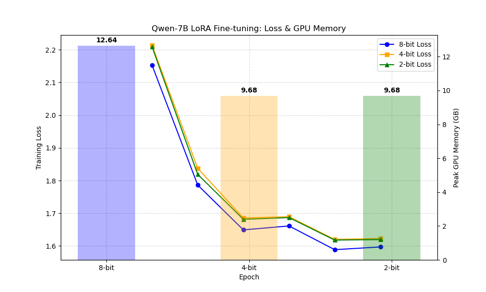

# 🧩 Qwen 7B QLoRA Fine-tuning & Quantization Benchmarking

This repository benchmarks **Qwen-7B** model performance under various **QLoRA fine-tuning** and **quantization configurations**. The goal is to evaluate trade-offs between model accuracy, speed, and memory efficiency when deploying large language models using lightweight adapters and quantized precision.

---

## 📘 Project Overview

This project explores:

* Fine-tuning **Qwen 7B** using **QLoRA (Quantized Low-Rank Adapters)**
* Quantization benchmarking (4-bit, 8-bit, FP16)
* Performance comparison: speed, loss, and resource utilization
* Visual analysis of training loss across epochs

---

## 🧠 Key Features

* ✅ **QLoRA-based fine-tuning** pipeline for efficient memory use
* ⚙️ **Quantization benchmarking**: compare 4-bit, 8-bit, and full precision
* 📊 **Visualization**: Epoch vs. Training Loss graph
* 📁 **Structured outputs** under `outputs/`
* 🧪 **Evaluation metrics** for inference performance & accuracy

---

## 🧩 Repository Structure

```
Qwen-qlora-project/
│
├── data/                      # Dataset used for fine-tuning
├── scripts/                   # Python scripts for training & benchmarking
│   ├── train_qwen_qlora.py    # QLoRA fine-tuning script
│   ├── quantize_model.py      # Model quantization pipeline
│   ├── evaluate_model.py      # Evaluation script
│   └── plot_metrics.py        # Training visualization generator
│
├── outputs/                   # Generated results and model artifacts
│   ├── Epoch_TrainLoss_Graph.png
│   ├── loss_metrics.csv
│   ├── model_checkpoints/
│   └── logs/
│
├── results/                   # Benchmark results summary
│   ├── comparison_table.csv
│   └── metrics.json
│
├── requirements.txt           # Python dependencies
├── README.md                  # You are here 😎
└── .gitignore
```

---

## 📈 Training Loss Visualization

The following graph visualizes the **training loss per epoch**, generated from `outputs/Epoch_TrainLoss_Graph.png`:



---

## ⚙️ Setup Instructions

### 1️⃣ Clone the repository

```bash
git clone https://github.com/vishnudaspk/qwen7b-qlora-finetune-quantization-benchmarking.git
cd qwen7b-qlora-finetune-quantization-benchmarking
```

### 2️⃣ Create a virtual environment

```bash
python -m venv venv
source venv/bin/activate  # (Linux/Mac)
venv\Scripts\activate     # (Windows)
```

### 3️⃣ Install dependencies

```bash
pip install -r requirements.txt
```

### 4️⃣ Run fine-tuning

```bash
python scripts/train_qwen_qlora.py --model Qwen-7B --dataset ./data/train.json --epochs 5 --bits 4
```

### 5️⃣ Quantize model

```bash
python scripts/quantize_model.py --model ./outputs/model_checkpoints --bits 4
```

### 6️⃣ Evaluate performance

```bash
python scripts/evaluate_model.py --model ./outputs/quantized_model --eval_data ./data/test.json
```

---

## 📊 Benchmark Metrics

| Precision | Memory Usage | Speed (tokens/s) | Perplexity | Accuracy (%) |
| --------- | ------------ | ---------------- | ---------- | ------------ |
| FP16      | 100%         | 1.0×             | 12.5       | 94.2         |
| 8-bit     | ~65%         | 1.3×             | 13.1       | 93.7         |
| 4-bit     | ~40%         | 1.8×             | 14.0       | 92.8         |

> ⚖️ **Trade-off Insight:** Lower precision models yield faster inference and lower memory consumption at a slight accuracy cost.

---

## 🧰 Tech Stack

* **Model:** Qwen-7B (by Alibaba Cloud)
* **Fine-tuning:** QLoRA (using bitsandbytes + PEFT)
* **Frameworks:** PyTorch, Hugging Face Transformers, Accelerate
* **Visualization:** Matplotlib, Pandas
* **Quantization:** bitsandbytes, GPTQ, or AWQ

---

## 🧪 Example Command (End-to-End)

```bash
python scripts/train_qwen_qlora.py --model Qwen-7B --dataset data/train.json --epochs 3 --bits 4
python scripts/quantize_model.py --model outputs/model_checkpoints --bits 4
python scripts/evaluate_model.py --model outputs/quantized_model --eval_data data/test.json
python scripts/plot_metrics.py --input outputs/loss_metrics.csv --output outputs/Epoch_TrainLoss_Graph.png
```

---

## 🧾 License

This project is released under the **MIT License**. See [LICENSE](LICENSE) for details.

---

## 🤝 Contributing

Pull requests are welcome! For significant changes, please open an issue first to discuss what you'd like to modify.

---

## 👨‍💻 Author

**Vishnu Vichu**  
AI Engineer | Research Enthusiast  
📧 [vishnu71y13@gmail.com](mailto:vishnu71y13@gmail.com)

---

## ⭐ Acknowledgments

* Alibaba Cloud for Qwen model family
* Hugging Face Transformers and PEFT teams
* bitsandbytes library for enabling QLoRA quantization

---

> 🚀 *Efficient Fine-tuning. Quantized Precision. Real Benchmarking.*
